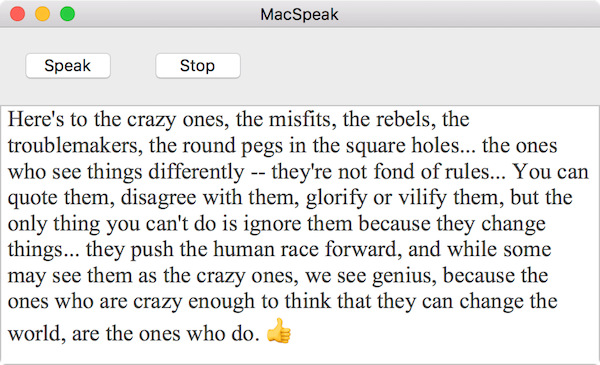
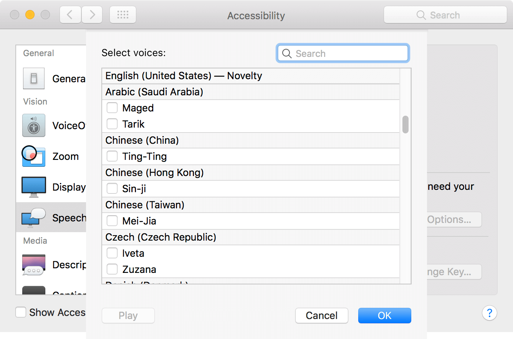

# MacSpeak

## Screenshots

Mac can speak English by default.

This use `NSSpeechSynthesizer`, you can even make it speak Mandarin or Madarin with accent(try with Mei-Jia 😄).

But for Mandarin other languages, you need first download these voices in System Preference. Then have fun with it.

[AVSpeech​Synthesizer](http://nshipster.com/avspeechsynthesizer/) -> an article about iOS SpeechSynthesizer
