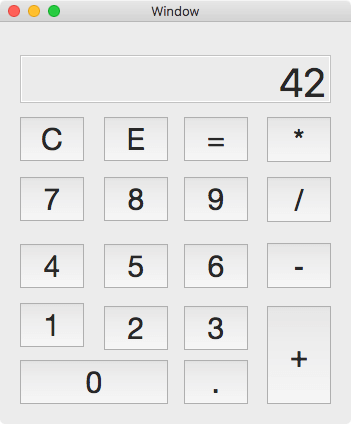

# FileViewer

## Screenshot

## Resource && Credits

[Stanford cs193p lecture 1 & lecture 2](https://itunes.apple.com/us/course/developing-ios-10-apps-with-swift/id1198467120)

Making a Calculator is actually not easy, except for the design part. You need to consider: 

- overflow calculate 
- how to display properly for large numbers 
- math errors(divide 0