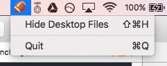

# HideDesktop

## Screenshot

A simple menubar App to hide messy desktop. Learn how to execute terminal command in Swift and create menubar-only interface. 

Thx to macOS based on Unix, use Terminal Tricks 