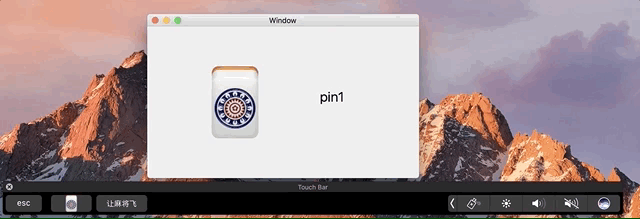
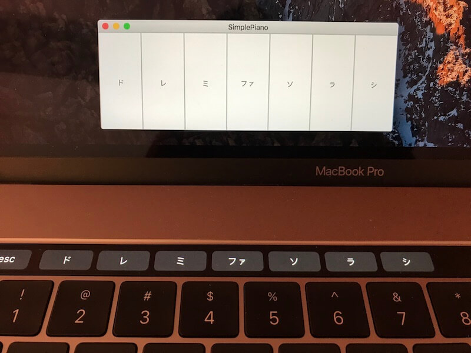

I tried iOS develop before and had some fun with it, and for the last four weeks, I spent some time play with macOS.

macOS related API is miscellaneous, and developing macOS is more evil, you can use Swift/ObjC, even js(say Atom), you can play with  NSTableView, NSCollectionView, Metal, SceneKit... You can even run Shell commands in your App. Not even to mention support AppleScript or Automator. It is fun and the process of seeking answer is also fun.

I copycat and followed some tutorials to make this 14 osx apps. Some are my own thoughts. 😀

Be cautious, some code are dangerous to use in a real production.

Apparently this was inspired by many SwiftXXProjects or XXDaysWithSwift. 

Next step is slow down,have fun,learn cautiously, maybe trying to perfect some code for real production usage.

01 - TouchBarMahjong

02 - Notepad

03 - MacSpeak

04 - ORLYStore

05 - YearProgress

06 - FileViewer

07 - Calculator

08 - Puzzle

09 - AppSearch

10 - SimplePiano

11 - HideDesktop

12 - Txt2PDF

13 - Pomodoro

14 - SlideMagic

